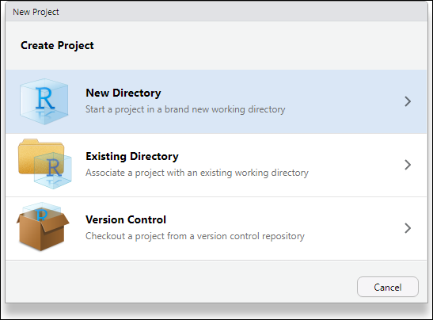
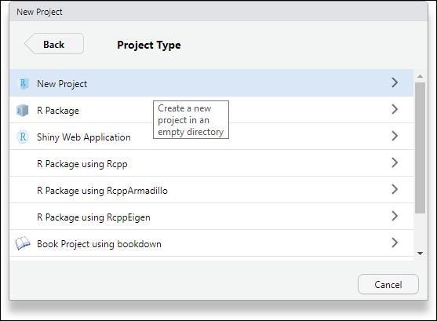
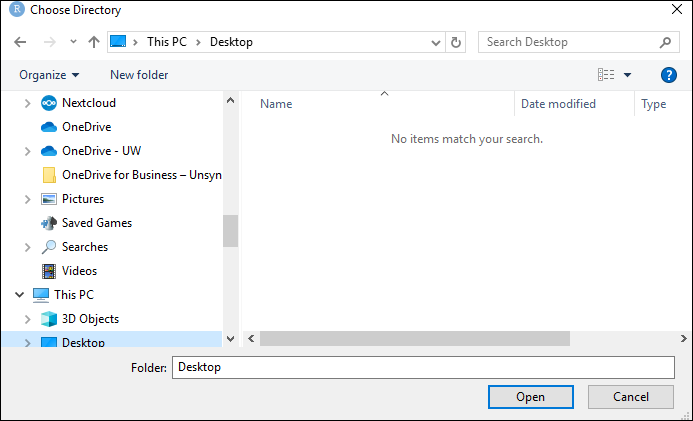
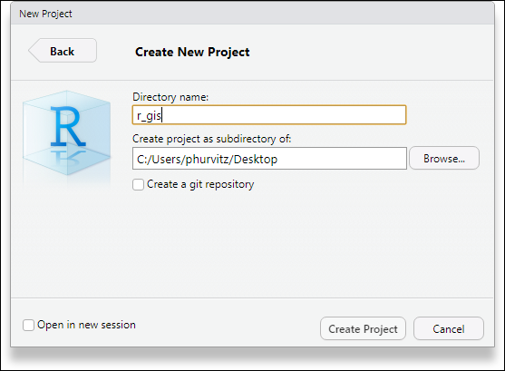
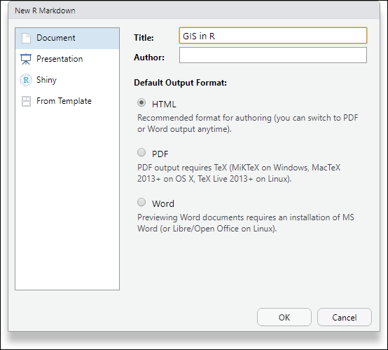
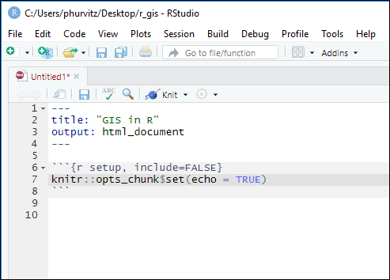
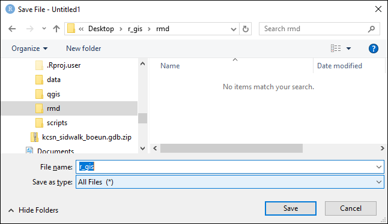
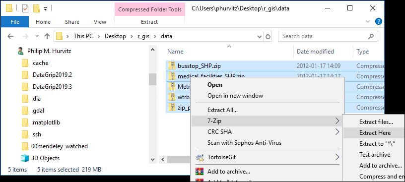
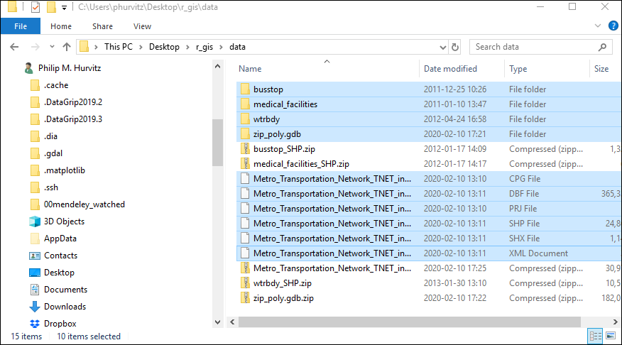

# Getting started {#getting_started}

Before we start, make sure that you have opened RStudio and QGIS on your computer.

## Install necessary packages

The most important packages We will be using for the GIS work are [`sf`](https://r-spatial.github.io/sf/articles/sf1.html), [`raster`](https://cran.r-project.org/web/packages/raster/index.html),  [`leaflet`](https://cran.r-project.org/web/packages/leaflet/), and [`rgdal`](). To install these and others that we will be using, enter at the R console prompt (or copy-and-paste):

```
install.packages(
    c("sf", 
    "raster", 
    "leaflet", 
    "rgdal", 
    "kableExtra", 
    "leaflet", 
    "dplyr",
    "pander",
    "knitr",
    "kableExtra",
    "tidycensus",
    "ggplot2",
    "forcats",
    "mapview")
)
```

This should only need to be done once on any user R installation.

## Create an RStudio project

Create a new RStudio project in a new folder on your desktop named `r_gis` (`File` > `New Project`).









__Create a few folders__

Use the `Files` pane and create three new folders names `scripts`, `data`, and `rmd`. These will be used to store various files in an organized fashion.

__Create an R Markdown file___

Create a new R script (`File > New File > R Markdown...)` 



Delete most of the content



And save it as `r_gis.Rmd` in your `rmd` folder.



This is the file that will store the code for this workshop.

In the `setup` chunk, add these lines for the packages we will be using:

```
library(kableExtra)
library(knitr)
library(leaflet)
library(pander)
library(sf)
library(tidycensus)
library(ggplot2)
library(dplyr)
library(forcats)
library(mapview)
```

and then save the Rmd file. Continue adding to the file as we progress, by copying code chunks from this book to your Rmd file.

## Download files

Download some files into the `data` folder you just created:

* [MetroKC transportation features](http://staff.washington.edu/phurvitz/r_gis/data/Metro_Transportation_Network_TNET_in_King_County__trans_network_line.zip)
* [MetroKC transit stops](http://staff.washington.edu/phurvitz/r_gis/data/busstop_SHP.zip)
* [KC GIS medical facilities](http://staff.washington.edu/phurvitz/r_gis/data/medical_facilities_SHP.zip)
* [KC GIS waterbodies](http://staff.washington.edu/phurvitz/r_gis/data/wtrbdy_SHP.zip)
* [Esri ZIP code polygons](http://staff.washington.edu/phurvitz/r_gis/data/zip_poly.gdb.zip)
* [Seattle community reporting areas](http://staff.washington.edu/phurvitz/r_gis/data/Community_Reporting_Areas.zip)

After you have downloaded the files, unzip them. The most efficient way to do this is to select all the files, R-click one of them, and then select `7-Zip` > `Extract Here`. 



You should now have a collection of files in your `data` folder, including the ones you downloaded.



## Preview data
In QGIS, create a new project (`Project` > `New` or use the keyboard shortcut `Ctrl-N`).

Make sure the `Browser` panel is available (`View` > `Panels `Browser`). This will make it easier to add layers to the project. Also make sure the `Layer Styling` panel is checked, which will enable you to quickly modify layer display properties.


Next, make a shortcut to the `data` folder by R-clicking `Favorites`, selecting `Add a Directory` and navigating the the `data` folder.


Expand all of the folders, and select the data sources you just downloaded and drag them onto the map display.


If you get dialogs for `Select Datum Transformations`, click __OK__.


The data set of ZIP code areas covers the entire US, so it may take some time to display them; to speed up the display process, R-click any of the King County layers and select `Zoom to Layer`.

Alter any of the layer display properties if the colors hurt your eyes.

 

## Save your project

Save the QGIS project in a new folder named `qgis`; ___Bonus___: What is the significance of the file name I used?


<!--

You can label chapter and section titles using `{#label}` after them, e.g., we can reference Chapter \@ref(intro). If you do not manually label them, there will be automatic labels anyway, e.g., Chapter \@ref(methods).

Figures and tables with captions will be placed in `figure` and `table` environments, respectively.


```r
par(mar = c(4, 4, .1, .1))
plot(pressure, type = 'b', pch = 19)
```

<div class="figure" style="text-align: center">

<p class="caption">(\#fig:nice-fig)Here is a nice figure!</p>
</div>

Reference a figure by its code chunk label with the `fig:` prefix, e.g., see Figure \@ref(fig:nice-fig). Similarly, you can reference tables generated from `knitr::kable()`, e.g., see Table \@ref(tab:nice-tab).


```r
knitr::kable(
  head(iris, 20), caption = 'Here is a nice table!',
  booktabs = TRUE
)
```


Table: (\#tab:nice-tab)Here is a nice table!

| Sepal.Length| Sepal.Width| Petal.Length| Petal.Width|Species |
|------------:|-----------:|------------:|-----------:|:-------|
|          5.1|         3.5|          1.4|         0.2|setosa  |
|          4.9|         3.0|          1.4|         0.2|setosa  |
|          4.7|         3.2|          1.3|         0.2|setosa  |
|          4.6|         3.1|          1.5|         0.2|setosa  |
|          5.0|         3.6|          1.4|         0.2|setosa  |
|          5.4|         3.9|          1.7|         0.4|setosa  |
|          4.6|         3.4|          1.4|         0.3|setosa  |
|          5.0|         3.4|          1.5|         0.2|setosa  |
|          4.4|         2.9|          1.4|         0.2|setosa  |
|          4.9|         3.1|          1.5|         0.1|setosa  |
|          5.4|         3.7|          1.5|         0.2|setosa  |
|          4.8|         3.4|          1.6|         0.2|setosa  |
|          4.8|         3.0|          1.4|         0.1|setosa  |
|          4.3|         3.0|          1.1|         0.1|setosa  |
|          5.8|         4.0|          1.2|         0.2|setosa  |
|          5.7|         4.4|          1.5|         0.4|setosa  |
|          5.4|         3.9|          1.3|         0.4|setosa  |
|          5.1|         3.5|          1.4|         0.3|setosa  |
|          5.7|         3.8|          1.7|         0.3|setosa  |
|          5.1|         3.8|          1.5|         0.3|setosa  |

You can write citations, too. For example, we are using the **bookdown** package [@R-bookdown] in this sample book, which was built on top of R Markdown and **knitr** [@xie2015].
-->
